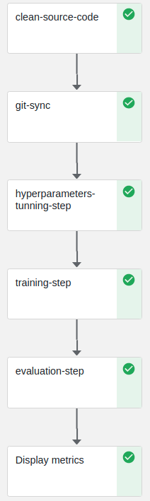
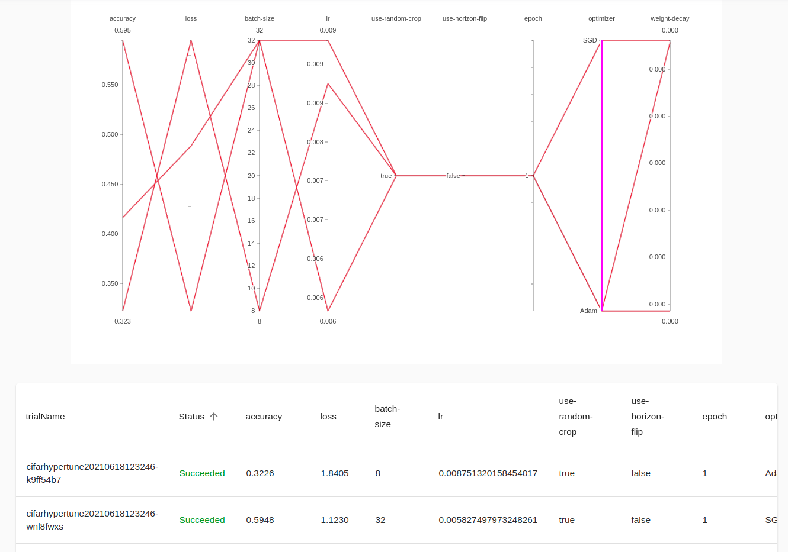

# Cifar10 - End to End Kubeflow System 

<!-- TABLE OF CONTENTS -->
<details open="open">
  <summary>Table of Contents</summary>
  <ol>
    <li>
      <a href="#1-about-the-project">About The Project</a>
      <ul>
        <li><a href="#built-with">Built With</a></li>
      </ul>
    </li>
    <li>
      <a href="#2-getting-started">Getting Started</a>
      <ul>
        <li><a href="#prerequisites">Prerequisites</a></li>
        <li><a href="#installation">Installation</a></li>
      </ul>
    </li>
    <li><a href="#3-usage">Usage</a></li>
    <li><a href="#4-benchmark">Benchmark</a></li>
    <li><a href="#5-help">Help</a></li>
    <li><a href="#6-authors">Authors</a></li>
    <li><a href="#7-version-history">Version History</a></li>
    <li><a href="#8-acknowledgements">Acknowledgements</a></li>
  </ol>
</details>

<!-- ABOUT THE PROJECT -->
## 1. About The Project





Kubeflow is a ....

In this project, I will build an end-to-end Machine learning system on Kubeflow. It provides components for 
each stage in the ML lifecycle, from data-preprocessing through hyperparameter tuning, training, evaluation and 
deployment automatically.
 
 ### Built With
 
 Major frameworks and tools are used in this project:
 * [Kubernetes]()
 * [Kubeflow pipeline](https://www.kubeflow.org/docs/about/kubeflow/)
 * [Trition inference server + KFServing]()
 * [ELK stack]()
 * [Pytorch]()
 
<!-- GETTING STARTED -->
## 2. Getting started

To get a local running follow these simple example steps

### Prerequisites

Before start, we need to initialize a Kubernetes cluster(on-prem or cloud).

Create a dynamic persistent volume as these [instructions]()

Install Kubeflow follow these [instructions](https://www.kubeflow.org/docs/started/installing-kubeflow/)

### Installation

1. Clone the repo
    ```
   git clone 
   ```
2. Create anaconda environment
   ```
   conda env create -f environment.yml
   ```
3. Install tools 
    ```
   cd config_template
   helm install .....
    ```
4. Check system
    ```
   kubectl get pods -A
   ```
   
## 3. Usage

If you want to know the structure of this system, feel free to read the spec document and system design document from 
[here]()

Follow steps below to  deploy code and operating system:

xxxxx

## 4. Benchmark 

### Results

## 5. Help

Help for problems  

## 6. Authors
 

## 7. Version History
* v1.0
    * 2021/02/08: xxx
 
* v1.1
    * 2021/03/11: Fix xxx
    
## 8. Acknowledgments


